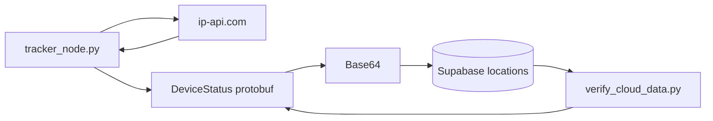

# Location Tracker

Edge-to-cloud location tracker for a Raspberry Pi. The device fetches coordinates from the [ip-api.com](http://ip-api.com/json/) geolocation API, serializes them with **Protocol Buffers**, and stores them in **Supabase**. A companion script verifies that cloud rows decode correctly.

Location is **IP-based only**—there is no GPS module or other on-device positioning hardware. Coordinates reflect the Pi’s public IP address (typically ISP/network-level accuracy, not precise device GPS).

## Architecture



1. **`tracker_node.py`** — Calls ip-api.com for lat/lon, builds a `DeviceStatus` message, serializes to binary, base64-encodes it, and inserts a row into Supabase.
2. **`verify_cloud_data.py`** — Fetches the latest `raw_payload`, decodes base64, and parses protobuf to confirm round-trip integrity.

## Project structure

```
gps_tracker/
├── README.md                 # This file
├── docs/
│   ├── SUPABASE.md           # Database table setup
│   └── SERVICE.md            # systemd units, install, logs, troubleshooting
├── protobuf/
│   └── tracker.proto         # DeviceStatus schema (source of truth)
└── tracker_app/
    ├── .env                  # Secrets (create locally; not committed)
    ├── .env.example          # Template for required variables
    ├── requirements.txt      # Pinned Python dependencies
    ├── tracker_pb2.py        # Generated from tracker.proto
    ├── tracker_node.py       # Send one location update to the cloud
    └── verify_cloud_data.py  # Read and decode the latest cloud row
```

## Prerequisites

- **Python 3.11+** (project tested with 3.13 on Raspberry Pi OS)
- **Network access** from the Pi (required for ip-api.com and Supabase)
- A **Supabase** project with a `locations` table (see [docs/SUPABASE.md](docs/SUPABASE.md))
- **`protoc`** (optional) — only needed when you change `tracker.proto`

## Quick start

### 1. Supabase

Create the `locations` table in your Supabase project. Step-by-step SQL and notes are in [docs/SUPABASE.md](docs/SUPABASE.md).

### 2. Python environment

```bash
cd /home/admin/gps_tracker/tracker_app
python3 -m venv venv
source venv/bin/activate
pip install -r requirements.txt
```

### 3. Configuration

```bash
cp .env.example .env
```

Edit `.env` and set:

| Variable | Description |
|----------|-------------|
| `SUPABASE_URL` | Project URL from Supabase → Settings → API |
| `SUPABASE_KEY` | **anon** public key (same settings page) |

Never commit `.env` or share keys in chat or screenshots.

### 4. Send a reading

```bash
source venv/bin/activate
python tracker_node.py
```

Expected output includes a successful ip-api.com response (lat/lon), payload size, and base64 string. On failure, check network connectivity, ip-api rate limits, and Supabase RLS/policies (see [docs/SUPABASE.md](docs/SUPABASE.md)).

### 5. Verify cloud data

```bash
python verify_cloud_data.py
```

You should see `--- SUCCESS ---` with device id, latitude, and longitude matching what was sent.

### 6. Run as a Linux service (optional)

To upload automatically every 5 minutes without SSH, use systemd on the Pi. Copy the unit files from **[docs/SERVICE.md](docs/SERVICE.md)** to `/etc/systemd/system/`, then:

```bash
sudo systemctl daemon-reload
sudo systemctl enable --now tracker.timer
journalctl -u tracker.service -f
```

## Protobuf schema

Defined in `protobuf/tracker.proto`:

| Field | Type | Description |
|-------|------|-------------|
| `device_id` | string | Fixed device identifier (currently `VALENTINA-PI-4B` in code) |
| `latitude` | double | WGS84 latitude |
| `longitude` | double | WGS84 longitude |
| `timestamp` | int64 | Unix epoch seconds |
| `is_safe` | bool | Safety flag (hard-coded `true` in sender today) |

### Regenerating Python bindings

After editing `tracker.proto`, install `protobuf` compiler support and regenerate:

```bash
# Debian / Raspberry Pi OS
sudo apt install protobuf-compiler

cd /home/admin/gps_tracker
protoc --python_out=tracker_app -I protobuf protobuf/tracker.proto
```

This overwrites `tracker_app/tracker_pb2.py`. Restart any running processes that import it.

## Payload format

Why base64? The Supabase REST client stores `raw_payload` as text. The pipeline is:

1. `DeviceStatus.SerializeToString()` → compact binary
2. `base64.b64encode(...).decode('utf-8')` → safe for JSON/text columns
3. Insert `{ "device_id": "...", "raw_payload": "<base64>" }`

Decoding (as in `verify_cloud_data.py`) reverses those steps.

## Location source (ip-api.com)

All coordinates come from a single HTTP GET in `fetch_location()`:

```http
GET http://ip-api.com/json/
```

On success, the JSON response supplies `lat` and `lon`. The free tier allows about **45 requests per minute** per IP; stay within that if you add periodic uploads.

Because lookup is IP-based, reported position may differ from the Pi’s physical location (VPN, mobile hotspot, or ISP routing). This project does not integrate GPS, `gpsd`, or UART modules.

## Configuration reference

| Item | Location | Notes |
|------|----------|-------|
| Device ID | `tracker_node.py` → `status.device_id` | Change per board or deployment |
| Geolocation API | `fetch_location()` in `tracker_node.py` | ip-api.com endpoint; only location source |
| Supabase table | `locations` | Must expose `device_id`, `raw_payload`; see docs |
| Rate limit | ip-api.com | ~45 requests/minute on free tier |

## Troubleshooting

| Symptom | Likely cause |
|---------|----------------|
| `Network error` on send | No internet or ip-api blocked |
| `Location error` from API | Rate limit or API failure; lat/lon may be null in payload |
| Supabase insert `Error` | Wrong URL/key, missing table, or RLS blocking inserts |
| `--- FAILED TO DECODE ---` | Empty table, corrupt base64, or proto/schema mismatch |
| Import error for `tracker_pb2` | Run from `tracker_app/` or set `PYTHONPATH` |

Run scripts from `tracker_app/` so imports and `.env` resolve correctly.

## Roadmap (not implemented yet)

- Skip Supabase upload when ip-api returns no coordinates
- `DEVICE_ID` and other settings via `.env` instead of hard-coded values
- Optional physical GPS module + `gpsd` (same systemd units; only the Python location source changes)

## License

Not specified in repository. Add a `LICENSE` file if you plan to distribute this project.
