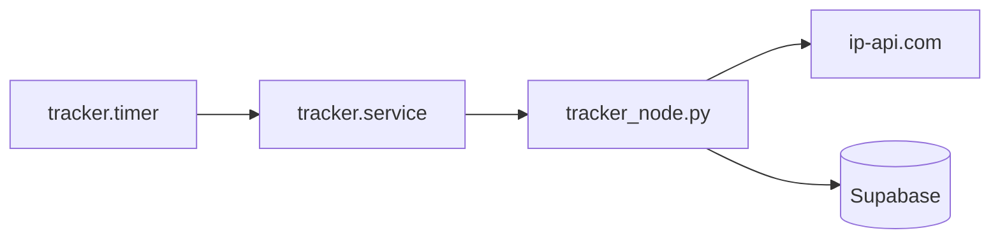

# Run the tracker as a Linux service

Use **systemd** on Raspberry Pi OS (or any Linux with systemd) to upload location data automatically—no SSH session required. The timer runs `tracker_node.py` once every **5 minutes** and again shortly after boot.

Location still comes from [ip-api.com](http://ip-api.com/json/) (IP geolocation). No GPS module or `gpsd` is required.

## How it works

| Unit | Type | Role |
|------|------|------|
| `tracker.service` | One-shot | Runs `tracker_node.py` once, then exits |
| `tracker.timer` | Timer | Triggers `tracker.service` every 5 min (+ 2 min after boot) |



This is **not** a long-running Python process. Each run fetches location, uploads, and stops—efficient for a Pi on a fixed schedule.

## Prerequisites

Complete these before enabling the timer:

1. [Supabase table](SUPABASE.md) created and RLS configured if needed
2. Python venv installed and dependencies from `requirements.txt`
3. `tracker_app/.env` with valid `SUPABASE_URL` and `SUPABASE_KEY`
4. **Manual test succeeds:**

   ```bash
   cd /home/admin/gps_tracker/tracker_app
   source venv/bin/activate
   python tracker_node.py
   python verify_cloud_data.py
   ```

## Install unit files

Create or copy two files under `/etc/systemd/system/`. Templates below match the default paths on this Pi (`admin` user, project at `/home/admin/gps_tracker`).

### `tracker.service`

```ini
[Unit]
Description=GPS tracker upload (one shot)
After=network-online.target
Wants=network-online.target

[Service]
Type=oneshot
User=admin
WorkingDirectory=/home/admin/gps_tracker/tracker_app
EnvironmentFile=/home/admin/gps_tracker/tracker_app/.env
ExecStart=/home/admin/gps_tracker/tracker_app/venv/bin/python tracker_node.py
StandardOutput=journal
StandardError=journal

[Install]
WantedBy=multi-user.target
```

### `tracker.timer`

```ini
[Unit]
Description=Run GPS tracker upload every 5 minutes

[Timer]
OnBootSec=2min
OnUnitActiveSec=5min
Unit=tracker.service

[Install]
WantedBy=timers.target
```

Install and reload:

```bash
sudo cp tracker.service tracker.timer /etc/systemd/system/
# Or paste the files above with: sudo nano /etc/systemd/system/tracker.service
sudo systemctl daemon-reload
```

### Paths to adjust

If your install directory or user differs from the defaults, edit `tracker.service` **before** copying:

| Setting | Default | Change when |
|---------|---------|-------------|
| `User` | `admin` | You run under another Linux user |
| `WorkingDirectory` | `/home/admin/gps_tracker/tracker_app` | Project lives elsewhere |
| `EnvironmentFile` | `/home/admin/gps_tracker/tracker_app/.env` | `.env` path differs |
| `ExecStart` | `.../venv/bin/python tracker_node.py` | No venv or different Python |

## Enable and start

```bash
sudo systemctl enable --now tracker.timer
```

Check the timer is active:

```bash
systemctl list-timers tracker.timer
systemctl status tracker.timer
```

Trigger one run immediately (optional):

```bash
sudo systemctl start tracker.service
```

## View logs

Service output goes to the systemd journal:

```bash
journalctl -u tracker.service -n 30
journalctl -u tracker.service -f
```

Look for successful ip-api lines and `Binary Payload Sent!` messages.

## Change upload interval

Edit `/etc/systemd/system/tracker.timer` (or the file in `deploy/` before install):

```ini
[Timer]
OnBootSec=2min
OnUnitActiveSec=5min
```

Then reload:

```bash
sudo systemctl daemon-reload
sudo systemctl restart tracker.timer
```

The ip-api.com free tier allows about **45 requests per minute** per IP. A 5-minute interval is well within that limit.

## Stop or disable

```bash
# Stop future scheduled runs (keeps unit files)
sudo systemctl disable --now tracker.timer

# Run service once manually while timer is disabled
sudo systemctl start tracker.service
```

## Uninstall

```bash
sudo systemctl disable --now tracker.timer
sudo rm /etc/systemd/system/tracker.service /etc/systemd/system/tracker.timer
sudo systemctl daemon-reload
```

## Troubleshooting

| Symptom | Likely cause | Fix |
|---------|----------------|-----|
| Timer inactive | Not enabled | `sudo systemctl enable --now tracker.timer` |
| `Failed to start` / exit code non-zero | Bad `.env`, missing venv, import error | Run `tracker_node.py` manually; fix paths in unit file |
| `Location error` / `Network error` in journal | No internet or ip-api failure | Check connectivity; wait and retry |
| Supabase `Error` in journal | Keys, RLS, or missing table | See [SUPABASE.md](SUPABASE.md) |
| No new rows but service “succeeds” | Lat/lon may be null on API failure | Check journal; improve script to skip failed lookups |
| Works manually, fails under systemd | Wrong `User`, `WorkingDirectory`, or `EnvironmentFile` | Align unit file paths with manual run environment |

## After reboot

The timer should start automatically if enabled:

```bash
systemctl is-enabled tracker.timer   # should print: enabled
```

Reboot test:

```bash
sudo reboot
# after login:
systemctl list-timers tracker.timer
journalctl -u tracker.service -n 10
```

## Optional: physical GPS later

If you add a GPS module and `gpsd` in the future, keep the same `tracker.service` / `tracker.timer`—only change how `tracker_node.py` obtains coordinates. See the project README roadmap.
