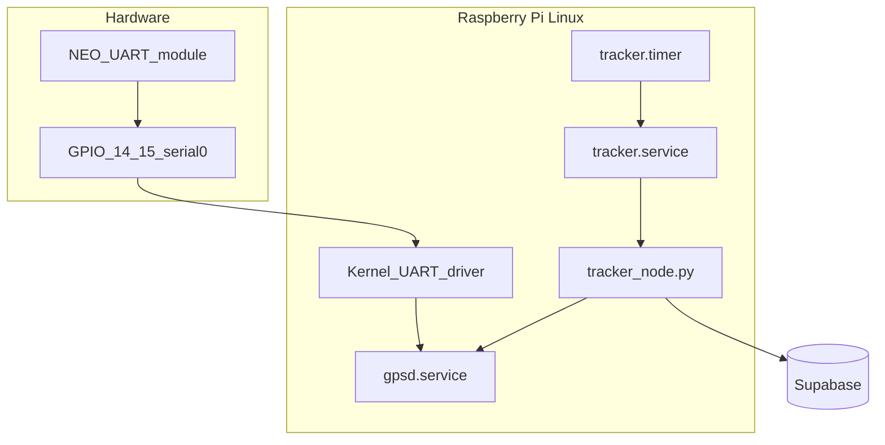

# Real GPS via UART + gpsd + systemd

## Hardware choice: **UART on GPIO**

**Selected:** GPS module wired to the Pi’s **hardware UART** (e.g. NEO-6M, NEO-7M, NEO-8M). **Not** USB dongle.



| Wire | GPS module | Raspberry Pi (BCM) | Physical pin |
|------|------------|-------------------|--------------|
| Power | VCC | **3.3V** | Pin 1 |
| Ground | GND | **GND** | Pin 6 |
| Data out | **TX** | **GPIO 15 (RXD0)** | Pin 10 |
| Data in | **RX** | **GPIO 14 (TXD0)** | Pin 8 |

**Critical:** Module **TX** → Pi **RX**, module **RX** → Pi **TX**. Use **3.3V** unless the module is explicitly 5V-tolerant.

**Linux “driver” stack (resume-accurate):**
- **Kernel:** built-in UART driver → `/dev/serial0` (often `ttyAMA0` or `ttyS0`)
- **Userspace:** **gpsd** reads `/dev/serial0` — you configure, not code the kernel driver

---

## Goal

Replace IP-only geolocation with **satellite positioning** from the UART module via **gpsd**, keeping protobuf → Supabase and **automated uploads** every 5 minutes via systemd.

| Layer | What | You code it? |
|-------|------|----------------|
| **UART GPS module** | NEO-style module on GPIO | No — buy + wire |
| **Kernel UART** | `/dev/serial0` | No — enable in `config.txt` |
| **gpsd** | Reads serial, parses NMEA | No — `apt install`, configure |
| **location_provider.py** | Python client → gpsd | **Yes** |
| **tracker_node.py** | Protobuf + Supabase | **Yes** (refactor) |
| **tracker.timer** | Upload every 5 min | No — systemd unit files |

**ip-api.com** stays as fallback (`LOCATION_SOURCE=ip`) for desk testing without sky view.

---

## Phase 1: UART wiring and gpsd setup

Full guide in [`docs/GPS.md`](docs/GPS.md). Order of operations:

### 1. Wire the module

Connect VCC, GND, TX, RX per table above. Antenna with sky view for first fix.

### 2. Enable UART on Pi 4 (Bookworm)

Edit `/boot/firmware/config.txt` (or `/boot/config.txt` on older images):

```ini
enable_uart=1
```

If GPIO serial is used by Bluetooth, add:

```ini
dtoverlay=disable-bt
```

Then `sudo raspi-config` → **Interface Options** → **Serial Port**:
- Login shell over serial: **No**
- Serial port hardware: **Yes**

Reboot.

### 3. Confirm device

```bash
ls -l /dev/serial0
# often -> ttyAMA0 or ttyS0
```

Ensure user is in `dialout` group: `groups` (admin already is).

Default baud for most NEO modules: **9600** (gpsd auto-detects in most cases).

### 4. Install and configure gpsd

```bash
sudo apt install gpsd gpsd-clients python3-gps
```

Edit `/etc/default/gpsd`:

```bash
START_DAEMON="true"
DEVICES="/dev/serial0"
GPSD_OPTIONS="-n"
```

`-n`: read GPS immediately without waiting for a client.

```bash
sudo systemctl enable --now gpsd
```

### 5. Verify outdoors

```bash
cgps -s
gpspipe -w -n 10
```

Wait for TPV `"mode": 2` or `3` with valid `lat`/`lon` (cold start: 1–15+ minutes).

### 6. Upload criteria

`tracker_node.py` uploads only when gpsd reports a valid fix (`mode >= 2`). Indoor/no antenna → skip insert.

**Do not** open `/dev/serial0` from Python while gpsd is running.

---

## Phase 2: Application changes

### [`tracker_app/location_provider.py`](tracker_app/location_provider.py)

| `LOCATION_SOURCE` | Behavior |
|-------------------|----------|
| `gpsd` (production default) | Connect `127.0.0.1:2947`, wait for TPV `mode >= 2` |
| `ip` | ip-api.com fallback |

Env: `LOCATION_SOURCE=gpsd`, `GPS_FIX_TIMEOUT_SEC=60`, `GPSD_HOST`, `GPSD_PORT`.

`python3-gps` via apt (`import gps`). Document venv approach in GPS.md (`--system-site-packages` or use system Python for gps import).

### [`tracker_node.py`](tracker_app/tracker_node.py)

- `get_location()` from provider
- Skip upload if `None`
- `DEVICE_ID` from `.env`

---

## Phase 3: systemd

| Unit | Role |
|------|------|
| `gpsd.service` | Always on — owns `/dev/serial0` |
| `tracker.service` | One-shot upload |
| `tracker.timer` | Every 5 min |

`tracker.service`: `After=gpsd.service`, `Wants=gpsd.service`

```bash
sudo systemctl enable --now gpsd
sudo systemctl enable --now tracker.timer
```

---

## Phase 4: Documentation

| File | UART-specific content |
|------|----------------------|
| [`docs/GPS.md`](docs/GPS.md) | Wiring diagram, config.txt, raspi-config, `/dev/serial0`, troubleshooting (wrong TX/RX, BT stealing UART, no fix) |
| [`docs/SERVICE.md`](docs/SERVICE.md) | gpsd must be running before timer |
| [`README.md`](README.md) | UART + gpsd architecture |

USB dongle: optional note in GPS.md appendix only — **not** this deployment.

---

## Phase 5: Testing

1. `cgps -s` fix outdoors on UART
2. `LOCATION_SOURCE=gpsd python tracker_node.py` → Supabase
3. `verify_cloud_data.py` matches ~`cgps` coords
4. Indoor → no upload
5. `journalctl -u tracker.service` every ~5 min
6. Reboot: `gpsd` + `tracker.timer` enabled

---

## Implementation order

1. Wire UART module + enable serial + configure gpsd → `cgps` fix
2. `location_provider.py` + refactor `tracker_node.py`
3. `deploy/` systemd units + `docs/GPS.md`
4. Enable `tracker.timer`

Say **execute the plan** to implement in the repo.

## Resume bullets (UART)

- Built a Raspberry Pi Linux location tracker in Python using Protocol Buffers and Supabase for edge-to-cloud data sync.
- Integrated a **UART GPS module** with Linux via the serial device stack and **gpsd** for satellite positioning on GPIO.
- Architected background location updates using **gpsd** and a **custom systemd timer** for reliable cloud synchronization every 5 minutes.
